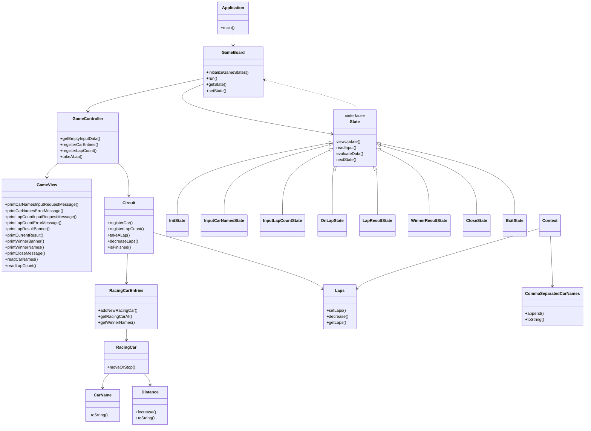

# Class diagram

**객체 목록**

| 객체명                    | 설명                                                     |
|------------------------|--------------------------------------------------------|
| CarName                | 경주 자동차 이름을 나타낸다                                        |
| CommaSeparatedCarNames | 콤마로 구분한 경주 자동차 이름 문자열을 관리한다                            |
| Distance               | 자동차가 이동한 거리를 나타낸다                                      |
| RacingCar              | 경주 자동차를 나타낸다                                           |
| RacingCarEntries       | 게임에 참가하는 경주 자동차 모음을 관리한다                               |
| Circuit                | 레이싱 경주 게임이 이루어지는 경기장을 나타낸다                             |
| Laps                   | 레이싱 경주 게임에서 서킷을 도는 횟수를 나타낸다                            |
| GameBoard              | 게임 Lifecycle 을 관리한다                                    |
| State                  | 게임 Lifecycle 에서 관리하는 여러 게임 상태를 일반화한 Interface 이다       |
| InitState, ...         | 각 게임 상태에서 필요한 동작을 상세하게 나타낸다                            |
| GameController         | GameBoard 에서 지시를 받아 화면 표시, 사용자 입력, 경주 자동차 데이터 조작을 요청한다 |
| Context                | GameBoard 와 State 사이에서 게임 정보를 주고 받기 위한 데이터 매개체를 나타낸다   |

 

