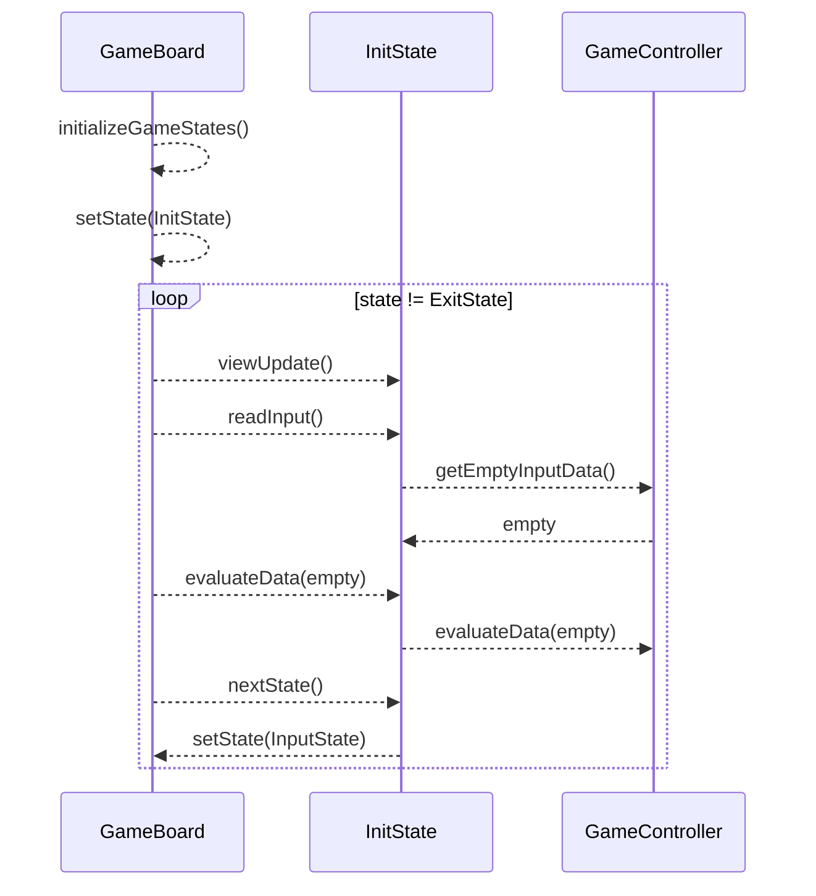
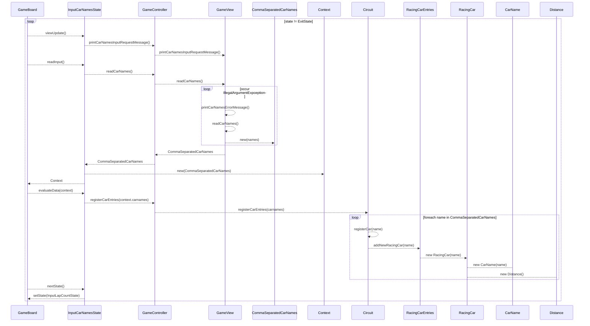
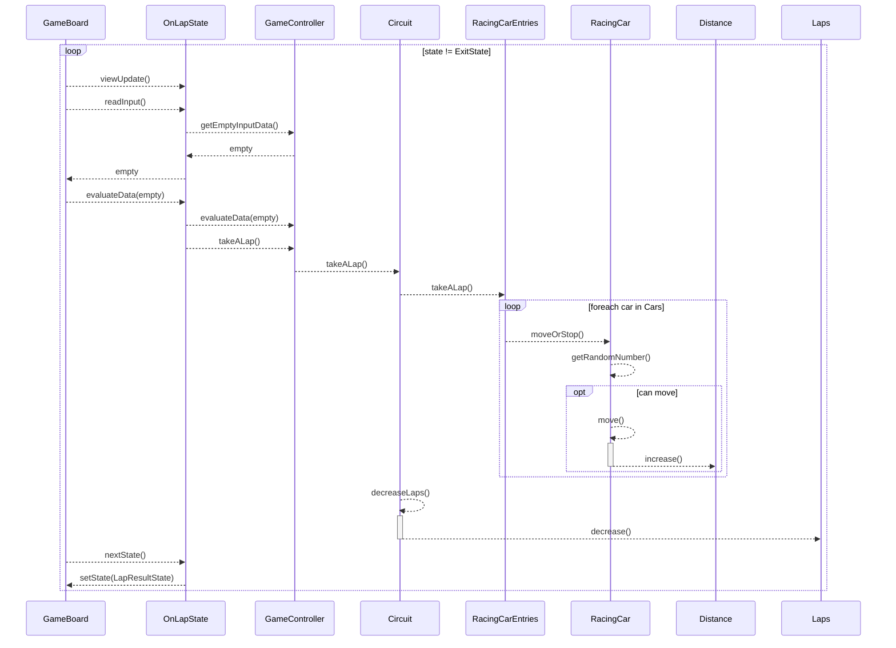
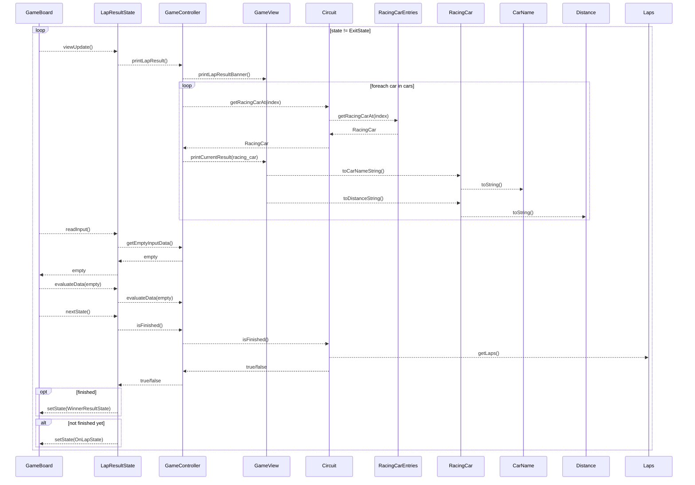
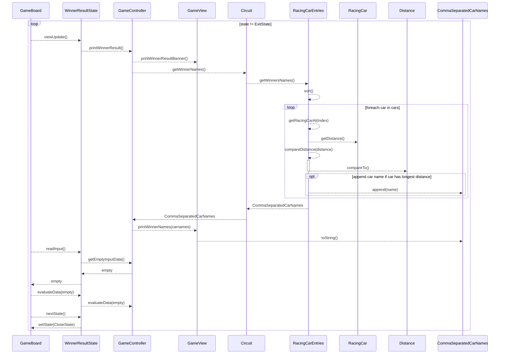
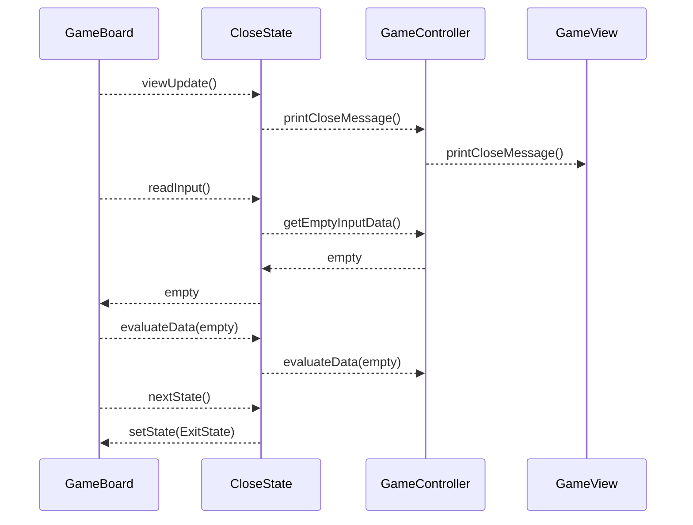

# 시퀸스 다이어그램

## Application.main()

GameBoard 를 초기화하고 게임을 실행한다.

## GameBoard.run() - INIT

**Init 게임 상태**일 때 수행하는 과정을 설명합니다.

게임 상태 객체를 준비하고 초기 게임 상태로 상태를 설정하고 게임 동작을 반복한다.

✔️ Application 에서 `run()` 요청한 부분은 생략합니다.

## GameBoard.run() - INPUT_CAR_NAMES

**InputCarNames 게임 상태**일 때 수행하는 과정을 설명합니다.

참가 자동차 이름들을 입력 받는 상태를 정의합니다.

✔️ Application 에서 `run()` 요청한 부분은 생략합니다.

## GameBoard.run() - INPUT_LAP_COUNT

**InputLapCount 게임 상태**일 때 수행하는 과정을 설명합니다.

이번 경주에서 트랙을 자동차가 주행할 총 이동 횟수를 입력 받는 상태를 정의합니다.

✔️ Application 에서 `run()` 요청한 부분은 생략합니다.

## GameBoard.run() - ON_LAP

**OnLap 게임 상태**일 때 수행하는 과정을 설명합니다.

한 번의 경주를 수행하는 상태를 정의합니다.

✔️ Application 에서 `run()` 요청한 부분은 생략합니다.

## GameBoard.run() - LAP_RESULT

**LapResult 게임 상태**일 때 수행하는 과정을 설명합니다.

실행 시점까지 자동차들이 이동한 결과를 출력하는 상태를 정의합니다.

✔️ Application 에서 `run()` 요청한 부분은 생략합니다.

## GameBoard.run() - WINNER_RESULT

**WinnerResult 게임 상태**일 때 수행하는 과정을 설명합니다.

최종 우승자를 출력하는 상태를 정의합니다.

✔️ Application 에서 `run()` 요청한 부분은 생략합니다.

## GameBoard.run() - CLOSE

**Close 게임 상태**일 때 수행하는 과정을 설명합니다.

게임 종료 메시지를 출력하는 상태를 정의합니다.

게임 흐름을 종료하려고 게임 종료 상태(ExitState)로 설정합니다.

✔️ Application 에서 `run()` 요청한 부분은 생략합니다.

