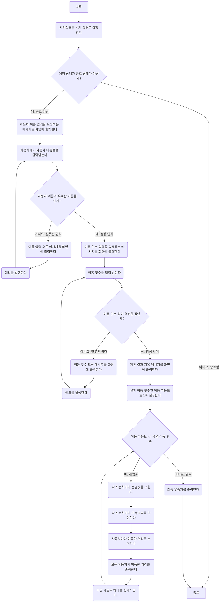

# 서비스 흐름도

⚠️ IntelliJ IDE 의 Mermaid 표시 버그로 한글 표시가 안 됨. Github 에서 확인해 주세요.

```mermaid
flowchart TD
  Start[시작] --> A1(게임상태를 초기 상태로 설정한다)
  A1 --> C1{게임 상태가 종료 상태가 아닌가?}
  
  C1 -->|예, 종료 아님| A2(자동차 이름 입력을 요청하는 메시지를 화면에 출력한다)
  C1 -->|아니요, 종료임| End[종료]
  
  A2 --> A3(사용자에게 자동차 이름들을 입력받는다)
  
  A3 --> C2{자동차 이름이 유효한 이름들인가?}
  C2 -->|예, 정상 입력| A4(이동 횟수 입력을 요청하는 메시지를 화면에 출력한다)
  C2 -->|아니요, 잘못된 입력| A5(이름 입력 오류 메시지를 화면에 출력한다)
  A5 --> A6(예외를 발생한다)
  A6 --> A3
  
  A4 --> A7(이동 횟수를 입력 받는다)
  
  A7 --> C3{이동 횟수 값이 유효한 값인가?}
  C3 -->|예, 정상 입력| A8(게임 결과 제목 메시지를 화면에 출력한다)
  C3 -->|아니요, 잘못된 입력| A9(이동 횟수 오류 메시지를 화면에 출력한다)
  A9 --> A10(예외를 발생한다)
  A10 --> A7

  A8 --> A11(실제 이동 횟수인 이동 카운트를 1로 설정한다)
  A11 --> C4{이동 카운트 <= 입력 이동 횟수}
  C4 -->|예, 게임중| A12(각 자동차마다 랜덤값을 구한다)
  C4 -->|아니요, 완주| A13(최종 우승자를 출력한다)
  
  A12 --> A14(각 자동차마다 이동여부를 판단한다)
  A14 --> A15(자동차마다 이동한 거리를 누적한다)
  A15 --> A16(모든 자동차가 이동한 거리를 출력한다)
  A16 --> A17(이동 카운트 하나를 증가시킨다)
  A17 --> C4

  A13 -----> End
```
