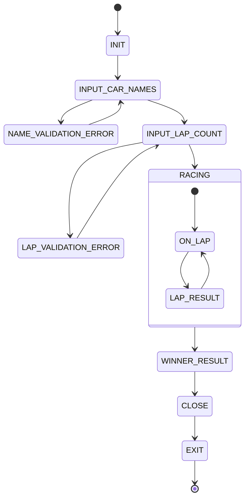

# 상태 다이어그램

8가지 게임 상태를 정의하고 상태 흐름을 구성합니다.

**상태 설명**

| 상태              | 설명                                                                    |
|-----------------|-----------------------------------------------------------------------|
| INIT            | 게임 초기 상태                                                              |
| INPUT_CAR_NAMES | 사용자에게 참가 자동차 이름들을 입력 받는 상태. 유효하지 않은 이름이면 에러 메시지를 출력하고 다시 입력을 받는다.  |
| INPUT_LAP_COUNT | 사용자에게 경주할 총 이동 횟수를 입력 받는 상태. 유효하지 않은 횟수이면 에러 메시지를 출력하고 다시 입력을 받는다. |
| ON_LAP          | 경주 한 바퀴를 진행한 상태                                                       |
| LAP_RESULT      | 현재까지 경주한 자동차 이동 결과를 출력하는 상태                                           |
| WINNER_RESULT   | 최종 우승자를 출력하는 상태                                                       |
| CLOSE           | 게임을 닫는 메시지를 출력하는 상태                                                   |
| EXIT            | 게임을 종료하는 상태                                                           |

